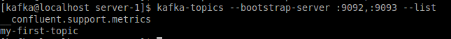
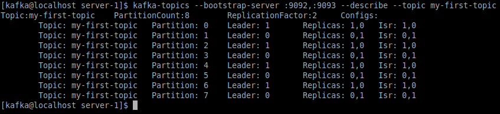

# Starten Kafka brokers
Zookeeper zelf doet niet meer dan de coördinatie over het Kafka-cluster, dus dat wil zeggen taken als het houden van verkiezingen m.b.t. het leiderschap voor een bepaalde partitie en het bijhouden van de beschikbaarheid van de leden van het cluster, dat zijn de servers die Kafka draaien (de Kafka brokers).

## Inrichten Kafka brokers
Een Kafka broker in het cluster moet contact kunnen maken met de coördinator (zookeeper.connect). Dat wil zeggen dat de netwerkadressen van de zookeeper servers bekend moeten zijn. Hiernaast moet iedere Kafka broker in hetzelfde cluster beschikken over:
- broker.id - unieke identificatie van de broker in het cluster
- log.dirs - directory waarin de commit log kan worden geschreven
- port - poortnummer waarop de broker kan worden benaderd.

We gaan een cluster maken dat draait op twee kafka brokers, op dezelfde host: dit betekent dat we in ieder geval verschillende log.dirs moeten gaan aanmaken en verschillende poorten moeten configureren. Uiteraard heeft ook de kafka broker weer een configuratie file die bestaat uit key-value pairs, en ook deze plaatsen we weer onder /opt/kafka/config/.

Allereerst maken we twee directories aan voor de commit logs, server-1 en server-2 onder /opt/kafka/logs:

```bash
mkdir -p /opt/kafka/logs/server-{1,2}
```

Hierna maken we voor beide servers een configuratie file aan met behulp van een editor naar keuze (kwrite voor de grafische geörienteerden, vi/vim voor de Linux adepten - sorry, geen emacs), bijvoorbeeld:

```bash
kwrite /opt/kafka/config/server-{1,2}.properties
```
Hierna moet je de onderstaande inhoud in het juiste bestand plaatsen en opslaan; hierna kun je de desbetreffende editor verlaten.

__/opt/kafka/config/server-1.properties__
```
port=9092
broker.id=0
log.dirs=/opt/kafka/logs/server-1
zookeeper.connect=:2181
```

__/opt/kafka/config/server-2.properties__
```
port=9093
broker.id=1
log.dirs=/opt/kafka/logs/server-2
zookeeper.connect=:2181
```

Binnen kafka kun je in het algemeen de hostname achterwege laten wanneer het de lokale machine betreft, zowel in configuratie als op de commandoregel.

## Let's get the party started!
Laten we de kafka servers gaan starten om aan de slag te gaan. Open een terminator venster en splitst dat in twee delen, hier moet je verschillende kafka brokers starten. Hiervoor is een script kafka-server-start meegeleverd in /opt/confluent/bin waaraan je de naam van he configuratiebestand als argument meegeeft (start het script nu niet zonder argument want dan wordt het standaard configuratiebestand gebruikt - en niet ons eigen configuratiebestand):
```bash
kafka-server-start /opt/kafka/config/server-1.properties
```
(_En m.m. hetzelfde commando voor de tweede kafka broker_)

## Off-topic?
Maar we zijn er nog niet, helaas. We hebben nu weliswaar een minimaal zookeeper cluster en een kafka cluster actief, maar er zijn nog géén topics geconfigureerd!

Als je terugbladert in een van de vensters waar je een Kafka broker hebt gestart, of je kijkt in het logbestand /var/log/kafka/server.log, dan zie je daar een configuratie-instelling (zoek op KafkaConfig) '_auto.create.topics.enable = true_'. Deze verzorgt dat topics automatisch worden aangemaakt, maar levert geen controle over andere relevante configuratie-instellingen zoals het aantal aan te maken partities of het aantal replica's dat moet worden geconfigureerd.
Leuk voor een ontwikkelomgevinkje, maar wij willen natuurlijk meer :metal:.

### On-topic
Uiteraard is er een apart commandoregelgereedschapje om topics aan te maken: kafka-topics. Bij het aanmaken van topics moet je aangeven naar welk cluster te verbinden (komma-gescheiden lijst van server:port), de naam van het topic, het aantal aan te maken partities en het aantal replica's van iedere partitie. Omdat kafka-topics een script is voor meerdere soorten bewerking, moet je ook aangeven dat je een topic wilt aanmaken:

Laten we op ons gloednieuwe, glimmende cluster een topic 'my-first-topic aanmaken', met acht partities en twee replica's:
```bash
kafka-topics --bootstrap-server :9092,:9093 --create --topic my-first-topic --partitions 8 --replication-factor 2
```

Als je geen foutmelding ziet, dan is het goed gegaan ... maar dat kunnen we beter even zelf controleren!
Met dezelfde tool kun je opvragen welke topics er allemaal bestaan op je cluster. Uiteraard hoef je hiervoor geen replication-factor, partitions of topic-name op te geven en in plaats van de actie _create_ wordt de actie nu _list_:



Dit geeft niet veel informatie over het topic, maar gelukkig hebben we ook nog de describe actie:


Wat zie je hier nu precies?
In ieder geval is duidelijk dat we inderdaad een topic hebben aangemaakt met 8 partities en een replicatie-factor van 2, d.w.z. van iedere partitie is één kopie. Per partitie wordt vermeld wat de primaire kopie is ("Leader"), waar de replica's staan en of de replica's "bij" zijn (Isr = In-sync-replica): berichten die naar de primaire kopie worden verstuurd worden gesynchroniseerd naar de replica's.

### Calling Kafka
- [X] Zookeeper Cluster
- [X] Kafka Cluster
- [X] Topic my-first-topic
- [ ] Nog geen berichten ...

Hoe krijgen we berichten gepubliceerd op een Kafka topic? Voor dit moment is het het eenvoudigste om met behulp van een script de berichten te publiceren.
Kafka levert een kafka-console-producer script mee waarmee je berichten kunt publiceren.

Op een terminator venster en start het script kafka-console-producer zonder argumenten: dit levert de informatie die je nodig hebt om het script te kunnen gebruiken door de __REQUIRED__ argumenten op de commandoregel toe te voegen met de juiste waarden.
Voer het commando dus nogmaals uit, maar nu met de juiste argumenten en schakelopties. Als je dit goed doet, dan krijg je een simpele prompt (>). Hierachter kun je een bericht ingeven en bij het afsluiten met \<ENTER\> wordt gepubliceerd op het opgegeven topic.
Publiceer twee berichten op het topic vanuit de producer.

### Calling Kafka .. again
- [X] Zookeeper Cluster
- [X] Kafka Cluster
- [X] Topic my-first-topic
- [X] Berichten
- [ ] Quo Vadis?

Waar gaan de berichten heen? Voorlopig nog uitsluitend naar de kafka partities, want we hebben nog geen applicaties gedefinieerd die het topic uitlezen.

Naast de kafka-console-producer is er ook een kafka-console-consumer (:tada:).
Laten we ervan uitgaan dat we voor het consumeren van berichten (minimaal) dezelfde informatie nodig hebben als voor het publiceren van informatie op het kafka topic, dus een lijst met bootstrap servers zodat we met het kafka cluster kunnen verbinden en een naam van een topic.

Splits het Terminator venster waarin je kafka-console-producer nog actief is en **start hierin een kafka-console-consumer**, zodat je de berichten kunt zien.

Wat gebeurt er? Helemaal niets ... je geproduceerde berichten worden tegen de verwachting in __niet__ opgehaald.
Kijk in het log-venster één van je kafka brokers of je kunt achterhalen wat de oorzaak is en hoe dit te verhelpen ... Google's your friend :-)
