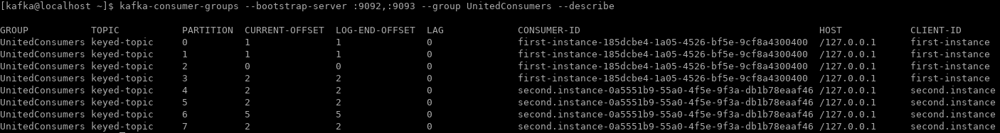

# John Bercow rules!
(John Bercow is de voorzitter van het Britse Lagerhuis, bekend vanwege zijn "Order, order!". Zelfs zijn kat heet naar verluidt [Order](https://nos.nl/artikel/2267757-lagerhuis-voorzitter-nu-zelf-beroemdheid-zelfs-zijn-kat-heet-order.html)...).

In ieder geval heb je net gemerkt dat Kafka toch wel verschilt van een reguliere message queue, zo is er geen echte volgorde gedefinieerd.
Het enige wat Kafka garandeert is dat berichten in dezelfde partitie geordend zijn, maar niet over de partities heen.

## Hoe te partitioneren?
Dit roept de vraag op op welke manier je berichten kunt sturen/koppelen aan een specifieke partitie en het antwoord is: niet.
Of in ieder geval: niet eenvoudig, hiervoor moet je een eigen partitioneringsschema schrijven geïmplementeerd in een [Java Partitioner implementatie](https://kafka.apache.org/23/javadoc/org/apache/kafka/clients/producer/Partitioner.html).

Wat Kafka wel garandeert is dat berichten met _dezelfde key_ altijd in _dezelfde partitie_ worden geplaatst (en dus zijn de berichten met dezelfd key geordend).

Tot nu toe hebben we berichten  verzonden zonder key, dus is er een key gegenereerd door Kafka zelf, ongerelateerd aan de message payload.

## Keyed topic
Laten we nog een topic **keyed-topic** aanmaken voor het testen van berichten met een sleutel; bij het aanmaken van het topic hoef je nog géén instellingen mee te geven (kafka gebruikt altijd een key), maar uitsluitend bij het puliceren van het bericht.
```
kafka-topics --bootstrap-server :9092,:9093 --create --topic keyed-topic --partitions 8 --replication-factor 2
```

### Keyed publish
Bij het publiceren van een bericht met een sleutel in de kafka-console-producer moet je aangeven dat wat je op één regel intikt, zowel een key als een message is en wat het scheidingsteken tussen beide vormt. Dit doe je door twee properties door te geven als "key=value", ieder achter een --property vlag (dus --property "key=value"). Aanhalingstekens/apostrofs zijn niet verplicht maar kunnen handig zijn ...
De properties zijn "parse.key=true" en "key.separator=<jouw-key-separator-hier>".

#### Message to Kafka
Start een kafka-console-producer met de  bovenvermelde opties en publiceer een aantal berichten met een verschillende key-waarden.
Herhaal dit en hergebruik dezelfde key-waarde (dit zou moeten leiden tot berichten die naar _dezelfde_ partitie worden gestuurd).

### Consumers
Laten we deze keer niet één maar twee consumers starten die gezamelijk het topic - in goed onderling overleg - uitlezen.
Zonder aanvullende configuratie-opties zouden beide consumers zich beide afzonderlijk abonneren op het topic en dus ieder de volledige set met berichten aangeleverd krijgen. Soms is dit wat je wilt, maar in andere gevallen wil je juist gebruik maken van een verdeling van dezelfde berichtenstroom over een aantal instanties van een afnemer om zo te kunnen schalen.

Het concept binnen Kafka dat hiervoor zorgt heet "consumer group" en is conceptueel simpel: iedere consumer binnen dezelfde consumer group krijgt een aantal partities toegewezen waaruit hij de berichten uitleest.
Hiervoor moet een group.id property worden aangeleverd en optioneel kan een  client.id worden aangeleverd, deze identificeert de consumer __instantie__.

Consumers met dezelfde group.id werken samen
__Vraag__ Is er een bovengrens aan het aantal consumers op een topic?

Ook de kafka-console-consumer moet een aantal consumer-properties definiëren op de sleutels van de berichten te tonen, t.w. eenzelfde key-separator (maar ditmaal voor de weergave, die kan dus verschillen van de producer) en print-key=true.

#### United consumers
(_We gaan nu éérst de consumers starten en pas daarna de producer, zodat we alle berichten te zien krijgen zonder --from-beginning_)

Start een terminator venster en splits dat in drieën (of, als je graag wilt: start drie vensters ...). Start binnen de eerste twee vensters twee instanties van consumers binnen dezelfde groep met een commando als onderstaand; specificeer een __ander__ *client.id* voor je tweede consumer, maar gebruik *dezelfde* __group.id__!

```
kafka-console-consumer --bootstrap-server :9092,:9093 --topic keyed-topic --property print.key=true --property key-separator=, --consumer-property group.id=UnitedConsumers --consumer-property client.id=first-instance
```

##### Consumer groups
Met behulp van kafka-consumer-groups (YAKCLU - Yet Another Kafka Command Line Utility) kun je informatie opvragen over de status van de consumer group. Start, in een nieuwe tab, het onderstaande commando om informatie op te vragen m.b.t. Kafka Consumer Groups:

```
kafka-consumer-groups --bootstrap-server :9092,:9093 --group UnitedConsumers --describe
```
Op dit moment zijn er al enkele berichten gepubliceerd op het nieuwe kafka topic, en pas daarna zijn de instanties uit UnitedConsumers geactiveerd:



Wat je kunt zien uit de uitvoer van het bovenstaande commando, is dat er twee instanties zijn in dezelfde consumer group die de acht partities netjes hebben verdeeld. Wat je óók kunt zien uit de uitvoer, is dat er al berichten aanwezig zijn in partities (log-end-offset > 0) en dat de huidige offset voor de consumer hetzelfde is, d.w.z. de achterstand ('lag') is 0 - de consumer is up-to-date met het topic (alhoewel we nog geen bericht hebben ontvanger in deze consumers) --> dit is het gedrag dat we eerder hebben gezien!

### Divide & Conquer
Publiceer nu - met de beide instanties actief - een aantal berichten vanuit de kafka-console-producer; als je producer en de consumers gelijktijdig kunt zien, zou je moeten kunnen vaststellen dat de berichten verdeeld worden over de consumers.
Hergebruik een sleutelwaarde in de producer die je al eerder hebt gebruikt; bij welke consumer komt dit bericht uit? Is dit structureel en zo ja: waarom?

#### Rebalancing consumers
Sluit nu één van je consumers af m.b.v. een welgemeende \CTRL\>-C in het desbetreffende venster. Publiceer hierna nog een aantal berichten vanuit je producer venster. Het gemakkelijkste is om een bericht te publiceren met een sleutelwaarde die voorheen uitkwam bij de consumer die je net hebt gestopt.
Voer nogmaals het commando uit voor een overzicht van de consumer groups.

Start nu de net beëindigde consumer en bekijk nogmaals de uitvoer van het kafka-consumer-groups commando. Als het goed is, dan zal nu weer een verdeling zijn gemaakt van de partities over beide consumers.

### SYS 64738 - reset the offsets


Stop allereerst beide consumer instanties (anders gaat het niet werken). Hierna kun je de offsets resetten door gebruik te maken van het volgende commando:

```
kafka-consumer-groups --bootstrap-server :9092,:9093 --group UnitedConsumers --topic keyed-topic --reset-offsets --to-earliest --execute
```
Verifieer dat de offsets zijn teruggezet, dus dat berichten opnieuw geconsumeerd kunnen worden:
```
kafka-consumer-groups --bootstrap-server :9092,:9093 --group UnitedConsumers --describe
```

Probeer nu de consumers zo snel mogelijk achter elkaar te starten door in de beide vensters alvast de opdracht klaar te zetten om de consumers te starten (m.b.v. commando historie, \<ARROW-UP\>), **maar start de opdracht nog niet**. Als in beide vensters de opdracht klaar staat, dan kun je die zo snel mogelijk achter elkaar starten door een ENTER te geven.
Je moet nu zien dat de "oude" berichten nogmaals worden aangeboden aan de afnemers en dat deze ook nu netjes worden verdeeld.
