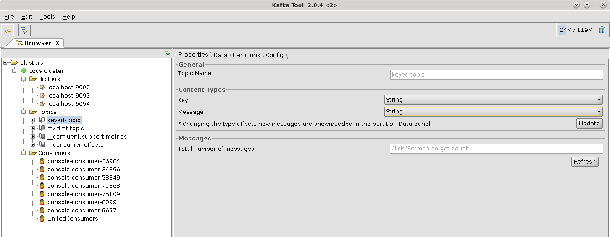
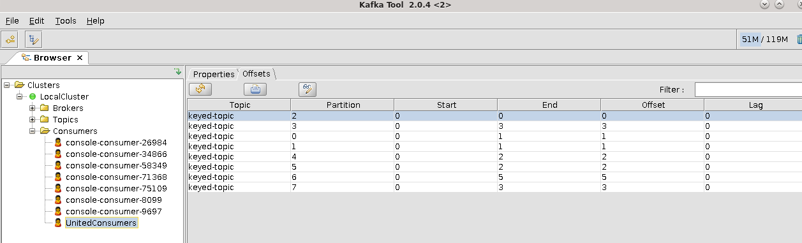
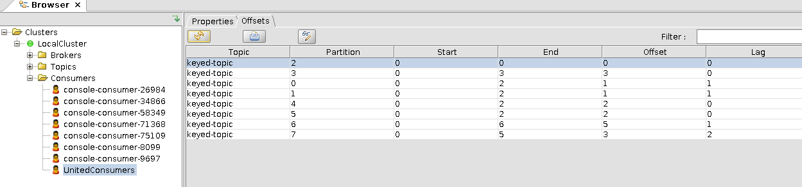

# Setup
Je kunt je volledige cluster (Zookeer + brokers), maar ook de producer en beide consumers actief laten.
Open een extra venster (splitsen) bij de consumer sectie. Maak een nieuwe log-directory  aan voor een derde kafka-broker:

`
mkdir -p /opt/kafka/logs/server-3
`

Maak vervolgens een nieuwe configuratiefile (server-3.properties lijkt een aardige naam) in /opt/kafka/config/, met de volgende instellingen:
```bash
port=9094
broker.id=2
log.dirs=/opt/kafka/logs/server-3
zookeeper.connect=:2181
offsets.topic.replication.factor=1
```

Voeg de server toe aan het cluster door deze in het nieuwe venster te starten:

`kafka-server-start /opt/kafka/config/server-3.properties`

## Unbalanced
Controleer na het starten van de server wat dat heeft gedaan met de verdeling van de partities over de brokers:

`kafka-topics --bootstrap-server :9092,:9093,:9094 --describe --topic keyed-topic`

Als het goed is, dan zie je  dat er niets is gebeurd met de partities van het topic: alle partities zijn nog toegewezen aan leader 0 of 1, ook de replica's zijn alle daar ondergebracht!
Da's sneu, hebben we een nieuwe server toegevoegd en wordt die niet gebruikt.

## Rebalancing - methode 1
Laten we een JSON bestand (topics.json) in elkaar sleutelen voor de topics die we willen herverdelen:
```JSON
{"topics":  [{"topic": "keyed-topic"}], "version":1}
```
Vervolgens moet je een nieuw bestand laten genereren voor de partitie toekenning (dat kun je ook allemaal met de hand doen ...):

`kafka-reassign-partitions --zookeeper :2181 --broker-list 0,1,2 --topics-to-move-json-file ./topics.json --generate`

Als je dit commando uitvoer, dan zie je de huidige configuratie, een lege regel en dan een voorgestelde nieuwe configuratie; deze kun je naar een bestand schrijven (want die hebben we zo nodig) door de laatste regel van de uitvoer te pellen:

`kafka-reassign-partitions --zookeeper :2181 --broker-list 0,1,2 --topics-to-move-json-file ./topics.json --generate | tail -1 > ./reconfigure.json`

Hierna kun je de herverdeling uitvoeren met:

`kafka-reassign-partitions.sh --zookeeper :2181 --reassignment-json-file ./reconfigure.json --execute`

Wacht even (er moet een klein aantal berichten gerepliceerd worden) en bekijk de verdeling van de topic partities opnieuw:


`kafka-topics --bootstrap-server :9092,:9093,:9094 --describe --topic keyed-topic`

## Rebalancing - methode 2
Sluit een van de drie kafka brokers, met een welgemeende en -gemikte \<CTRL\>-C in zijn venster.
Wacht een halve minuut en controleer of de servers opnieuw uitgebalanceerd zijn, ook m.b.t. de replica's:

`kafka-topics --bootstrap-server :9092,:9093,:9094 --describe --topic keyed-topic`

Als het goed is, dan zie je dat iedere partities wel een leader heeft, maar dat sommige partities een kopie hebben op de server die nu down is.
Als we deze server opnieuw opbrengen, en dan nogmaals controleren of de server uitgebalanceerd is, dan zie je dat dat **niet** het geval is: de server die herstart is, is nog nergens "leader" geworden en fungeert dus uitsluitend als replica-server. Zonde.

Voor de tweede methode gebruiken we:

`kafka-preferred-replica-election --bootstrap-server :9092,:9093,:9094`

Controleer vervolgens dat deze actie de partities weer netjes heeft verdeeld en dat alle drie de brokers 'leader' zijn voor bepaalde partities.

# Handwerk?
Is het dan allemaal handwerk, die interactie met Kafka? Alleen maar commando's die ingetikt moeten worden?
Het antwoord is: Nee, er bestaan ook een aantal grafische monitoring applicaties waarmee je je Kafka-cluster kunt beheren en die in meerdere of mindere mate ook al dit soort acties kunnen uitvoeren.

Op dit Virtual Box image zijn er drie geïnstalleerd:
- KafkaTool
- Conduktor
- Confluent monitoring


Start de KafkaTool door (een keer) te klikken op het icoon op de desktop, connect naar het cluster en blader naar je topic. Om de sleutel en inhoud van de berichten te kunnen zien, moet KafkaTool worden ingesteld om de juiste deserialisatie ... Zowel de sleutel als het bericht worden opgeslagen als BYTE ARRAY en tools moet worden verteld hoe die te interpreteren. Kies voor beide (key + message) voor de optie "String" en klik op de Update knop:



Als je vervolgens naar het data tabblad gaat en op het "Play" (driehoekje) klikt, dan moet je je berichten (en sleutels) terug kunnen herkennen.

Je kunt met deze tool ook per partitie zien welke berichten er aanwezig zijn, waar de replica's zich bevinden etc.

Hiernaast kun je per consumer nagaan hoever deze is met lezen:



Sluit beide consumers af en publiceer nog wat berichtjes. Ververs daarna de offsets in de consumers tab en je zult zien dat de LAG is opgelopen.


