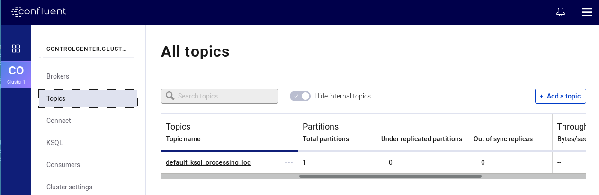

# Streams as in BEER!
Voor de volgende opdracht gaan we de streaming data mogelijkheden van Kafka bekijken. Kafka heeft naast de Consumer en Producer APIs ook nog een API voor Kafka Streams, dat is een Java API waarvan je gebruik kunt maken om streaming data te manipuleren in Apache Kafka.

Naast een Java API is er nog een andere hulpmiddel beschikbaar dat misschien niet alle mogelijkheden van de Kafka Streams API heeft, maar wel vele malen gebruiksvriendelijker is en misschien wel 80% van de typische scenario's waarin je Kafka Streams zou kunnen gebruiken, afdekt: KSQL.

Met behulp van KSQL kun je met een SQL-achtige commando taal objecten definieren in Kafka Streams, nl. KStreams en KTables.

## Omgeving
Voor deze opdracht ga je gebruik maken van het Confluent Kafka platform, omdat KSQL hierin al is geïntegreerd. [KSQL](https://github.com/confluentinc/ksql) zelf is ook verkrijgbaar als los component.

Zorg ervoor dat al je Kafka brokers, consumers, zookeepers etc. zijn afgesloten door een \<CONTROL\>-C in de desbetreffende vensters. Het kan even duren voordat het component definitief is afgesloten, begin met de brokers en eindig bij de zookeeper.

Start vervolgens de KSQL-server op het Confluent Platform met:
`confluent local start ksql-server`. Hiermee worden automatisch ook alle overige  benodigde componentent gestart (zoals ZooKeeper, Kafka en de schema-registry)
Hierna kun je het Confluent Control Center dashboard starten met `confluent start local control-center`.
Het control center is een webapplicatie op poort 9021 van je lokale server.

## Control center
Start een browser sessie naar port 9021 op je lokale machine; selecteer vervolgens je cluster  in de blauwe linker balk en kies "Topics" om een nieuw topic aan te gaan maken:

Maak vervolgens een nieuw topic COUNTRIES aan met één partitie; de replicatiefactor is nu per definitie  1, want het confluent cluster is lokaal in ontwikkelmodus gestart.
In de folder 'data' in de Git repository is een data file aangeleverd waarin een countries.csv file aanwezig is. Laadt deze in je nieuw aangemaakte topic door de inhoud van de file naar de kafka-console-producer te cat'ten in het nieuwe aangemaakte topic, de broker draait op de standaard poort 9092.

## KSQL, here we come!
Start hierna een KSQL client op om streams te kunnen manipuleren; start een terminal venster naar keuze en voer `ksql` uit.
Na enkele seconden i KSQL actief en toont een vriendelijke prompt 'ksql>'. Maximaliseer het venster en vraag uit welke topics er nu gedefinieerd zijn op het cluste waarmee je verbinding het gemaakt:

`show topics;`

Je eindigt je commando's met een puntkomma!

Uit de uitvoer zie je dat er een heleboel interne kafka topics aangemaakt zijn door het control center zelf, maar als het goed is zie je je eigen topic COUNTRIES ook terug.

Laten we proberen de inhoud van het topic (de berichten dus) te tonen:
`print COUNTRIES;`

Geen data ... hier is hetzelfde aan de hand als we eerder hebben meegemaakt, waarbij een Kafka client die zich aanmeldt __nadat__ de data is geproduceerd, deze standaard niet te zien krijgt!

Beëindig de lopende opdracht met een enkele welgemeende \<CONTROL\>-C.

Nog een keer, maar nu met een _from beginning_ toegevoegd aan het commando:
`print COUNTRIES from beginning;`

Nu wordt de data wel getoond (samen met de ontvangstdatum en sleutelwaarde NULL), maar ook nu blijft het commando wachten op data ...
Het toevoegen van een _limit_ biedt hier uitkomst om eenvoudig een sectie van de data te kunnen bekijken:
`print COUNTRIES from beginning limit 20;`

### Streams of data
Laten we een stream definieren op de data in dit topic; zie het commando in [data/countries-format.txt](data/countries-format.txt) om een stream te declareren in KSQL.

Maak de  countries_stream aan met het commando.

Mmm, KSQL klinkt als SQL ... laten we eens proberen om een SELECT op de stream uit te voeren:
`SELECT * FROM countries_stream;`

Helaas, pindakaas. Weer hetzelfde probleem als met de andere opdrachten. Dit probleem is (voor de huidige sessie) in een keer op te lossen door:
`SET 'auto.offset.rest'='earliest';` uit te voeren op de KSQL prompt!
