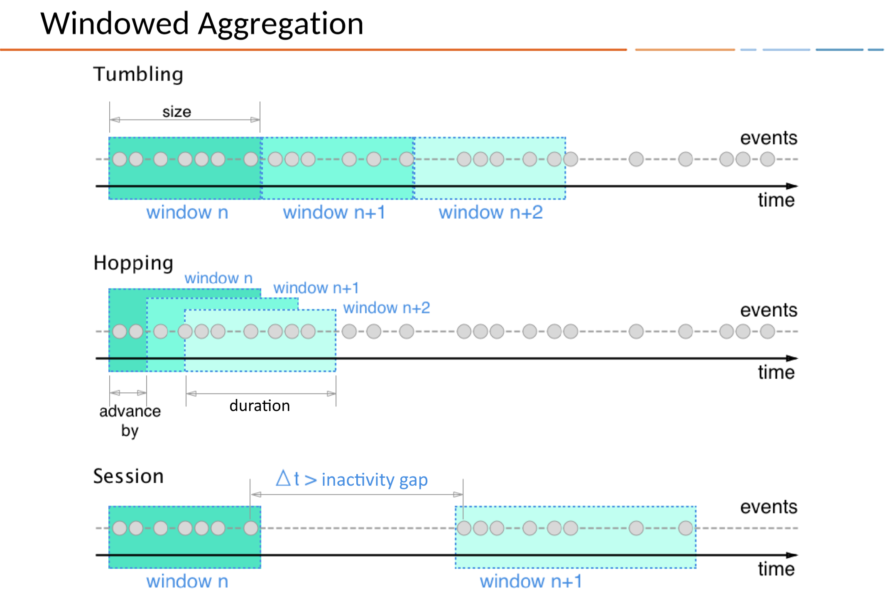
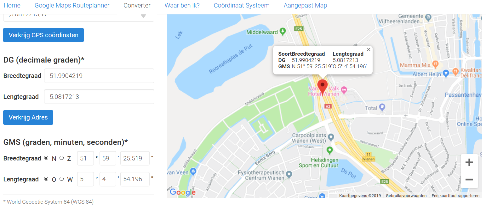

# One stream to rule them all!
Tja, en wat is nu een workshop zonder een opgave die (enigszins) gerelateerd is aan of geforceerd wordt naar bier?

Dus, hier komt-'ie aan!

## Streams
Streams zijn natuurlijk vooral interessant als ze geen einde hebben, zodat de data binnen blijft stromen. Laten we in deze opgave gaan kijken naar een scenario waarbij beoordelingen van bier door liefhebbers worden ingegeven via een user agent (browser, mobiele applicatie) en doorgestuurd naar ons Kafka cluster.

## Voorbereiding
Controleer dat je de volgende zakens hebt draaien, met behulp van `confluent local status`, d.w.z. dat de volgende componenten de status "UP" hebben:
- zookeeper
- kafka
- ksql-server
- schema-registry

Zo niet, dan kun je de component starten met `confluent local start [COMPONENT-NAME]`. Als dat niet werkt, reboot dan de machine en voer een `confluent local start ksql-server` uit.

## Berichtgrammatica
We zullen in deze opgave afdwingen dat de berichten die gepubliceerd worden voldoen aan een vooraf gedefinieerde bericht grammatica of schema. Voor Confluent Kafka is een schema-registry beschikbaar, die berichtdefinities bevat in AVRO formaat. De berichten die worden verzonden in AVRO formaat, worden als binaire data aangeleverd en bevatten een verwijzing naar de schema-versie die in de schema-registry is opgenomen. De definities voor een AVRO file zijn geschreven in [JSON](https://avro.apache.org/docs/1.8.1/spec.html).

### beer_ratings_v1
Laten we beginnen met een eenvoudige versie, bestaande uit:
- identificatie: numeriek, oplopend vanaf 1
- tijdstip (UNIX epoch natuurlijk)
- gebruikersnaam
- biercode
- waardering (10-100)

Kijk naar de definitie van het AVRO schema [beer_rating.avsc](../code/beer_rating.avsc). Wat je hierin terugziet, zijn de benoemde velden; in sommige gevallen is enige extra informatie aangeleverd over de mogelijke waarden die het veld kan aannemen, zodat we met de generator aan de slag kunnen (en je dus geen data zelf hoeft in te voeren).

### Push some beers
Men neme ...
- [x] topic: BEERSCORES (dit hoef je niet expliciet aan te maken, Kafka is standaard geconfigureerd dat niet-bestaande topics automatisch worden aangemaakt met default instellingen, zodat je daar geen controle over hebt.)
- [x] schema-definitie: zie [code/beer_rating.avsc](../code/beer_rating.avsc)
- [x] ksql-datagen: de generator.

Laten we 10 beer_ratings publiceren op een (nieuw aan te maken) topic 	BEERSCORES, in AVRO formaat waarbij we de schema-definitie gebruiken. Voer het volgende commando uit in een terminal venster:

```
ksql-datagen schema=beer_rating.avsc format=avro topic=BEERSCORES key=beer_rating_id iterations=10
```
## KSQL
Start in terminal venster KSQL, zodat je de gegenereerde data kunt bekijken. Zet allereerst de offset automatisch terug, opdat je alle berichten kunt zien: `set 'auto.offset.reset'='earliest';`

### Ground Rules ksql
Voor de interactie met KSQL zijn wat basisregels:
- [X] commando's eindingen met een PUNTKOMMA (;).
- [X] identifiers die NIET zijn omgeven door aanhalingstekens worden impliciet omgezet naar HOOFDLETTERS.
- [X] commando's zijn BLOCKING (want het is STREAMING data), tenzij een LIMIT wordt opgegeven ... Af te breken met de algemeen bekende \<CTRL\>-C
- [X] je kunt objecten uitlijsten met SHOW (TOPICS|STREAMS|QUERIES);, detailinformatie met DESCRIBE <naam>;

Hierna kun je je 10 gegenereerde berichten bekijken:
`print BEERSCORES limit 10;`

Als je in het onderstaand voorbeeld kijkt, dan zie je dat Kafka (KSQL) het formaat direct herkent en de velden juist benoemd, inclusief datatype:


### BEERSTREAM
Als we een streaming query willen definieren op deze ratings, dan kunnen we eenvoudig het volgende commando uitvoeren (Kafka/Schema definieert per slot van rekening al de structuur):
```
CREATE STREAM BEERSCORESTREAM WITH ( KAFKA_TOPIC='BEERSCORES', VALUE_FORMAT='AVRO');
```
Controleer dat je van deze nieuw aangemaakte Kafka stream kunt lezen door eeb query uit te voeren tegen de stream (`select * from BEERSCORESTREAM limit 2;`).

Bekijk de structuur die KSQL voor je stream heeft gedefinieerd door een `describe` uit te voeren op je stream, _vergeet de afsluitende puntkomma niet_!

Je kunt binnen KSQL ook allerlei functies aanroepen (het lijkt écht net SQL), zoals bijvoorbeeld functies om een timestamp (BIGINT) te converteren naar een leesbare datum/tijd:
```
select timestamptostring(beer_time, 'dd-MM-YYYY HH:mm:ss.SSS')
from   BEERSCORESTREAM limit 10;
```

### Loading Beers
Er is een bestandje gemaakt met de "bierdefinities", d.w.z. een bestand met
```JSON
MOOSE#{ "ID" : "MOOSE", "NAME" : "Moose On The Loose","BREWER" : "UILTJE", "BEERTYPE" : "NEIPA","ABV": 6.0,"VOLUME" : 0.44}
HOP#{ "ID" : "HOP", "NAME" : "Hop Zij Met Ons","BREWER" : "JOPEN", "BEERTYPE" : "IPA","ABV": 6.0,"VOLUME" : 0.30}
...
```
Het formaat is:
KEY#JSON-MESSAGE.
Het JSON bericht bestaat uit een ID (=message key), naam van het bier, brouwer, volumeprocenten alcohol en volume (uiteraard in SI eenheden, dus liters ...).

_Krijg je een foutmelding over de 'LEADER_NOT_AVAILABLE', dan was het topic nog niet volledig klaar ... Herhaal dan de laad-opdracht, dan wordt de data nogmaals aangeboden. Omdat we straks een tabel op unieke sleutel aanmaken, zie je uiteindelijk iedere entry maar één keer._

** Wil je deze foutmelding voorkomen, maak dan het topic aan vóórdat je gaat laden ** (maar lazy loading is eenvoudiger :-)

```bash
cat /pad-naar-git-repofiles/data/beers.json | \
  kafka-console-producer --property "parse.key=true" \
    --property "key.separator=#" --broker-list :9092 --topic BEERS
```

Na het laden van deze data in het topic "BEERS", willen we hier een referentietabel van maken (zodat iedere key=ID slechts een keer voorkomt).
Dat doe je door het commando in [code/beers_table_from_beers_stream.ksql](../code/beers_table_from_beers_stream.ksql) uit te voeren binnen KSQL, uiteraard **nadat** je de data hebt geladen ...


## Letting the BEER flow!
Proost! En laten we nu wat data genereren op basis van de AVRO schema-definitie en de KSQL-datagenerator. Als je ksql-datagen zonder verdere argumenten uitvoert, dan zie je wat de standaardinstellingen zijn voor het aantal iteraties en de maximale tussentijd tussen de berichten. Nu is met onze beperkte gebruikersgroep de tussentijd tussen de berichten iets te klein, maar dan hebben we snel een lekkere hoeveelheid data - heb je een langzame laptop/weinig geheugen of weinig CPUs toegekend, dan kun je de tussentijd ophogen na enkele secondes. In andere gevallen `ksql-datagen schema=beer_rating.avsc format=avro topic=BEERSCORES key=beer_rating_id`.

### Volg de scorestream
Voer in je KSQL venster een query uit om real-time de scores te laten zien, in principe zou je zelf een query moeten kunnen "brouwen", mocht het niet lukken kijk dan in [GITHUB-HOME/code/ksql-1-beerscorestream.ksql](code\ksql-1-beerscorestream.ksql).

**Om een volgende opdracht te kunnen uitvoeren moet je waarschijnlijk eerst de lopende query afbreken met \<CTRL\>-C!**

### Telling per biertje
Hoeveel zijn er per biertje geconsumeerd? Dit is een eenvoudige aggregatie-query, maar de crux is dat de query dóór blijft lopen, omdat het een datastream is!
Schrijf dus een query om het aantal per biertje te bepalen; hier is de [oplossing](../code/ksql-2-aantal-per-bier.ksql).

#### Windowed Queries
Zoals je ziet, kun je veel wijzigingen verwachten. In principe wordt een resultaat in de aggregate getoond, zodra het wijzigt en loopt de historie terug tot aan het begin ...

Je kunt ook een WINDOW clausule gebruiken om aan te geven dat de aggregate over een tijdsvenster moet plaatsvinden. Deze aggregatie-windows zijn binnen Kafka Streams (en dus KSQL) op drie manieren te definieren:



De syntax voor de window clausule is:
```
SELECT select_expr [, ...]
  FROM from_item
  [ LEFT JOIN join_table ON join_criteria ]
  [ WINDOW window_expression ]
  [ WHERE condition ]
  [ GROUP BY grouping_expression ]
  [ HAVING having_expression ]
  [ LIMIT count ];
```

Hierin kun je een window clausule opgeven als:

```
WINDOW TUMBLING (SIZE 20 SECONDS)
```

**Opgave**: schrijf een query die het aantal per bier telt in een niet-overlappend venster van één minuut ([oplossing](../code/ksql-3-aantal-windowed.ksql)).


### Missing ...
Welke clausule uit een SQL-statement ontbreekt in het bovenstaande SELECT statement? De eerste die de query goed weet te beantwoorden, verdient een mooie Kafka give-away! (_antwoorden per e-mail naar Milco_).

### Een bier is geen bier ...
Tot op dit moment hebben we alleen queries geschreven die worden geëvalueerd tegen één afzonderlijke tabel. Laten we nu eens een link leggen tussen de binnenkomende stroom events (BEERSCORESTREAM) en de (statische) KTable (BEERS).
Uiteraard werkt dit zoals je verwacht met een left join, dus definieer een eenvoudige query om een volledige projectie uit te voeren op de stream en de tabel (zie [hier](../code/ksql-4-join.ksql).

### Query ideetjes

**Waarschijnlijk heb je inmiddels wel genoeg data verzameld, dus je kunt de generator prima afbreken ... dan veranderen de totalen ook niet meer!**

Om te voorkomen dat we overal op het gemiddelde uitkomen, moeten we misschien nog maar even wat "gewogen" scores van een van de collega's toevoegen met een separaat berichtdefinitie (waardoor de bieren en de ranges worden bijgewerkt). Zie de definitie van [beer_ratingv2.avsc](../code/beer_ratingv2.avsc):
Open dus een terminal venster en genereer wat echte ratings:

```bash
ksql-datagen schema=/pad/naar/beer_ratingv2.avsc format=avro topic=BEERSCORES key=beer_rating_id maxInterval=1 iterations=1000
```

Laten we nog wat andere query ideeën uitvoeren, zoals:
- waardering per bier: bier, aantal scores, gemiddelde score - [code/ksql-5-aantal-score.ksql]
- totaal aantal per biertype
- totaal volume per biertype in liters [code/ksql-6-totaal-biertype.ksql]
- welke bierliefhebber heeft de meeste liters alcohol gedronken? [code/ksql-7-user-abv.ksql]

### Meer uitdaging?
Ik heb een [derde versie](../code/beer_ratingv3.avsc) gemaakt van de beer_rating definitie. Hierin heb ik een lengte- en breedtegraad toegevoegd die willekeurig worden gegenereerd, zo grofweg ergens binnen de coordinaten van Nederland.

1. Genereer met deze nieuwe defintie extra data in het bestaande topic.
2. Definieer een nieuwe stroom gebaseerd op het bestaande topic; realiseer je hierbij dat er in het topic óók nog data bevat **zonder** positie!
3. Maak een query die de afstand bepaalt van de beer_rating ten opzichte van je huidige locatie (gebruik de functie geo_distance, afstand uiteraard in kilometers). Zet hierbij expliciet de afstand op NULL als er geen positie bekend is. Je huidige locatie is ongeveer latitude=51.9904219,longitude=5.0817213 
4. Kijk eens naar het voorbeeld uit het [Confluent KSQL kookboek "verdachte transacties"](https://www.confluent.io/stream-processing-cookbook/ksql-recipes/detecting-abnormal-transactions). Zou je een query kunnen destilleren om een lijstje te maken van 'verdachte' checkins, d.w.z. checkins die binnen een uur uit elkaar liggen maar meer dan 100 km zijn gescheiden qua afstand?
