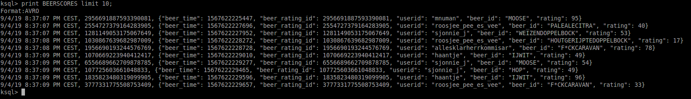

# One stream to rule them all!
Tja, en wat is nu een workshop zonder een opgave die (enigszins) gerelateerd is aan of geforceerd wordt naar bier?

Dus, hier komt-'ie aan!

## Streams
Streams zijn natuurlijk vooral interessant als ze geen einde hebben, zodat de data binnen blijft stromen. Laten we in deze opgave gaan kijken naar een scenario waarbij beoordelingen van bier door liefhebbers worden ingegeven via een user agent (browser, mobiele applicatie) en doorgestuurd naar ons Kafka cluster.

## Voorbereiding
Controleer dat je de volgende zakens hebt draaien, met behulp van `confluent local status`, d.w.z. dat de volgende componenten de status "UP" hebben:
- zookeeper
- kafka
- ksql-server
- schema-registry

Zo niet, dan kun je de component starten met `confluent local start [COMPONENT-NAME]`. Als dat niet werkt, reboot dan de machine en voer een `confluent local start ksql-server` uit.

## Berichtgrammatica
We zullen in deze opgave afdwingen dat de berichten die gepubliceerd worden voldoen aan een vooraf gedefinieerde bericht grammatica of schema. Voor Confluent Kafka is een schema-registry beschikbaar, die berichtdefinities bevat in AVRO formaat. De berichten die worden verzonden in AVRO formaat, worden als binaire data aangeleverd en bevatten een verwijzing naar de schema-versie die in de schema-registry is opgenomen. De definities voor een AVRO file zijn geschreven in [JSON](https://avro.apache.org/docs/1.8.1/spec.html).

### beer_ratings_v1
Laten we beginnen met een eenvoudige versie, bestaande uit:
- identificatie: numeriek, oplopend vanaf 1
- tijdstip (UNIX epoch natuurlijk)
- gebruikersnaam
- biercode
- waardering (10-100)

Kijk naar de definitie van het AVRO schema [beer_rating.avsc](../code/beer_rating.avsc). Wat je hierin terugziet, zijn de benoemde velden; in sommige gevallen is enige extra informatie aangeleverd over de mogelijke waarden die het veld kan aannemen, zodat we met de generator aan de slag kunnen (en je dus geen data zelf hoeft in te voeren).

### Push some beers
Men neme ...
- [x] topic: BEERSCORES (dit hoef je niet expliciet aan te maken, Kafka is standaard geconfigureerd dat niet-bestaande topics automatisch worden aangemaakt met default instellingen, zodat je daar geen controle over hebt.)
- [x] schema-definitie: zie [code/beer_rating.avsc](../code/beer_rating.avsc)
- [x] ksql-datagen: de generator.

Laten we 10 beer_ratings publiceren op een (nieuw aan te maken) topic 	BEERSCORES, in AVRO formaat waarbij we de schema-definitie gebruiken. Voer het volgende commando uit in een terminal venster:

```
ksql-datagen schema=beers.avsc format=avro topic=BEERSCORES key=beer_rating_id iterations=10
```
## KSQL
Start in terminal venster KSQL, zodat je de gegenereerde data kunt bekijken. Zet allereerst de offset automatisch terug, opdat je alle berichten kunt zien: `set 'auto.offset.reset'='earliest';`

Hierna kun je je 10 gegenereerde berichten bekijken:
`print BEERSCORES limit 10;`

Als je in het onderstaand voorbeeld kijkt, dan zie je dat Kafka (KSQL) het formaat direct herkent en de velden juist benoemd, inclusief datatype:


### BEERSTREAM
Als we een streaming query willen definieren op deze ratings, dan kunnen we eenvoudig het volgende commando uitvoeren (Kafka/Schema definieert per slot van rekening al de structuur):
```
CREATE STREAM BIERSCORESTREAM WITH ( KAFKA_TOPIC='BEERSCORES', VALUE_FORMAT='AVRO');
```
Controleer dat je van deze nieuw aangemaakte Kafka stream kunt lezen door eeb query uit te voeren tegen de stream (`select * from BIERSCORESTREAM limit 2`).

Bekijk de structuur die KSQL voor je stream heeft gedefinieerd door een `describe` uit te voeren op je stream, _vergeet de afsluitende puntkomma niet_!

Je kunt binnen KSQL ook allerlei functies aanroepen (het lijkt écht net SQL), zoals bijvoorbeeld functies om een timestamp (BIGINT) te converteren naar een leesbare datum/tijd:
```
select timestamptostring(beer_time, 'dd-MM-YYYY HH:mm:ss.SSS')
from   bierscorestream limit 10;
```

### Loading Beers
Er is een bestandje gemaakt met de "bierdefinities", d.w.z. een tekstbestandje als:
```csv
IJWIT;IJwit,IJ,WIBIER,6.5,0.33
WITTEROOK;Witte Rook,JOPEN,SMOKED,7.0,0.25
...
```
Het formaat is:
CODE;Naam,Brouwer,Soort,ABV,inhoud
CODE is de unieke sleutel, ABV is het aantal volume-procenten alcohol, de inhoud is in liters.

```bash
cat /pad-naar-git-repofiles/data/beers.txt | \
  kafka-console-producer --property "parse.key=true" \ 
    --property "key.separator=;" --broker-list :9092 --topic BEERS
```

Na het laden van deze data in het topic "BEERS", willen we hier nog een referentietabel van maken (zodat iedere code slechts een keer voorkomt):

CREATE TABLE BEERS_TABLE (CODE VARCHAR, NAME VARCHAR, BREWER VARCHAR, BEERTYPE VARCHAR, ABV DOUBLE, VOLUME DOUBLE) WITH (KAFKA_TOPIC=BEERS,VALUE_FORMAT=DELIMITED,KEY=CODE);
