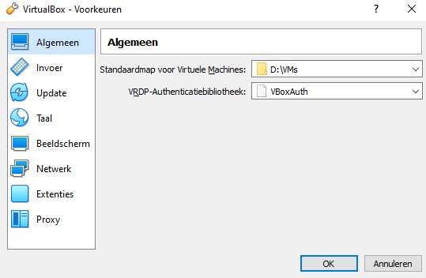
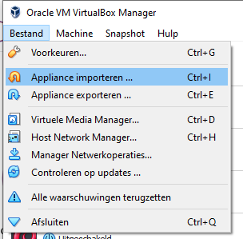
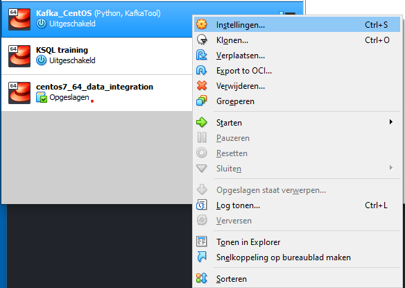
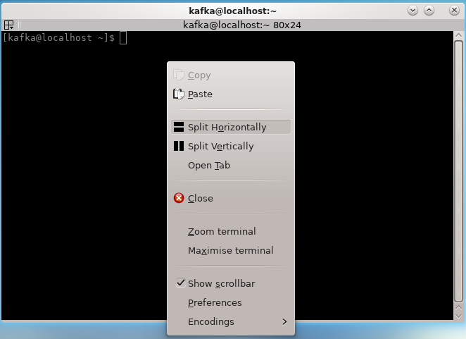
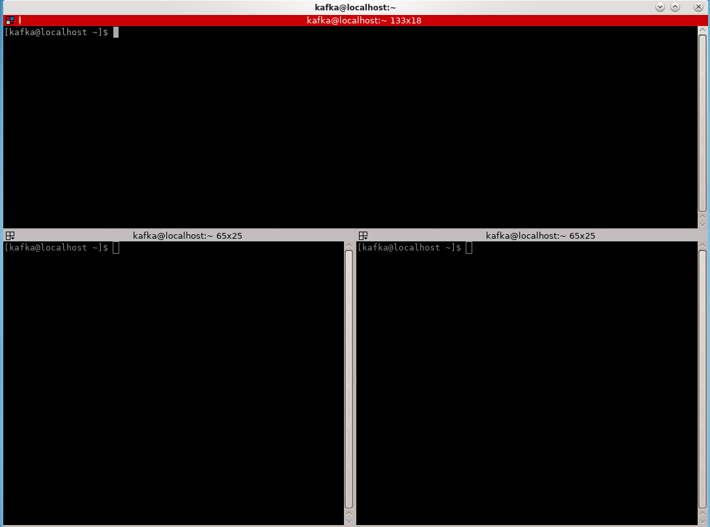
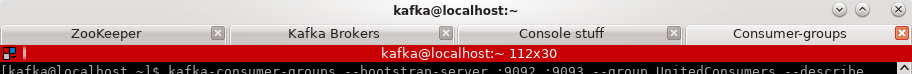

# Virtual Box Image

Het Virtual Box image is gemaakt voor VirtualBox 6.0.10 of hoger; VirtualBox kan voor jouw OS gedownload worden op de [Virtual Box](https://www.virtualbox.org/wiki/Downloads) site

## Systeemvereisten

* Virtual Box 6.0.10 of later
* 8 GB intern geheugen
* 4 CPU cores (kan worden bijgesteld)
* 25 GB vrije schijfruimte

## Importeren
Stel **eerst** met behulp van de voorkeuren in waar de Virtual Box images standaard moeten worden weggeschreven:

Vervolgens kun je de opgeslagen OVA (Virtual Box Appliance) importeren:

### Post-import taken
Je kunt het aantal processoren dat je aan je VirtualBox image toekent bijstellen door op het de VBox te selecteren en het context menu (Windows: rechter muisknop) te gebruiken; hier kies je in het menu "Instellingen":

Normaliter deel ik files tussen mijn host (laptop) en client (VBox) door gebruik te maken van de gedeelde folder functionaliteit, in mijn geval heb ik een gedeelde folder aangemaakt naar D:\VMs\Shared. Je kunt deze folder definitie verwijderen en eventueel vervangen door een folder van jouw keuze:

## VBox starten
Je kunt de VBox starten door erop te dubbelklikken; na een paar minuten tijd is het systeem opgestart en kun je inloggen:

## Belangrijke gegevens
Het VBox image is gebaseerd op CentOS 7 (gebaseerd Red Hat Enterprise Linux).
Hierop zijn geïnstalleerd:
* Oracle Java JDK 1.8u221
* Confluent Kafka Platform (5.3), gebaseerd op Kafka 2.3.0
* Terminator (terminal multiplexer)
* Python 3 + confluent_kafka library
* KafkaTool 2

### Login gegevens

Op de VirtualBox omgeving zijn de volgende gebruikers gedefinieerd:

Gebruikersnaam | Wachtwoord
---------------|------------
kafka          | kafka
root           | wortel

## Terminal
Op dit VirtualBox image zijn verschillende terminals geïnstalleerd:
- Konsole: dit is de standaard terminal van CentOS
- Terminator: dit is een terminal multiplexer, hier kun je in hetzelfde venster verschillende terminal sessies actief hebben en horizontaal en/of verticaal splitsen. Voor beide programma's is een snelkoppeling op de desktop geplaatst, let op dat je hierop maar één keer hoeft te klikken ...

### Terminator
Als je het context venster boven een terminator window activeert (rechter muisknop), dan wordt een menu getoond waarmee je je huidige venster kunt splitsen:

Je kunt de venster horizontaal en verticaal splitsen en aanpassen qua grootte:

Tip: je kunt verschillende tabs openen in terminator, maar hoe weet je nu wat er achter welke tab verstopt zit? Als je dubbelklikt op de tab, dan kun je je de tabs eenvoudig voorzien van een titel!

## Notities
De directory /opt/confluent/bin is toegevoegd aan het standaard zoekpad, je kunt de Kafka scripts dus zonder pad-locatie direct uitvoeren!
